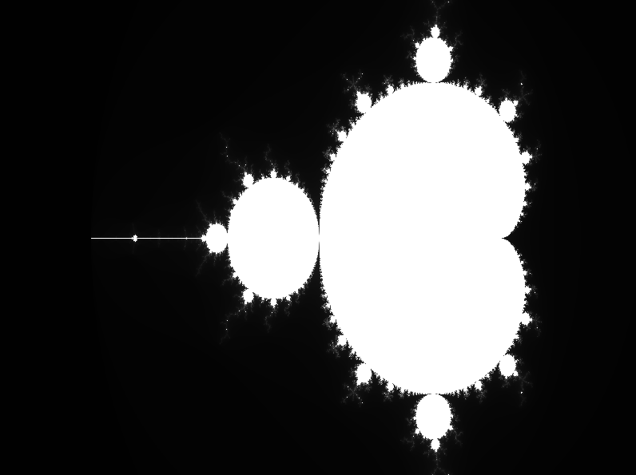

# Mandelbrot Set Parallelization Project

This project computes and visualizes the Mandelbrot set using three different implementations:
- Sequential (baseline)
- OpenMP (multithreaded CPU parallelism)
- MPI (distributed memory parallelism)

It also measures and compares execution times across implementations.

## Output

Each run generates:
- A '.pgm' image file ('mandelbrot.pgm')
- Console output showing execution time in seconds

Dark pixels = points that escape quickly  
Light pixels = points that stay longer (or are in the set)

Run MPI executable:

mpirun -np 4 ./mandel_mpi

Run sequential + OpenMP executable

.\main

